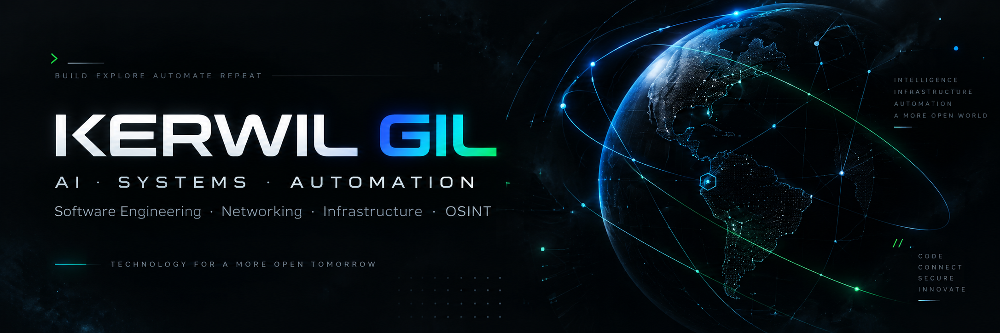

  

---

# 👋 Hola, soy Kerwil Gil

**Ing. Telecomunicaciones · Lic. Gerencia de Comercio Electrónico · Master AI**

Construyo software, agentes de IA, infraestructura y automatización. Me especializo en sistemas locales-first, herramientas de diagnóstico de red, plataformas SaaS multi-tenant y soluciones de inteligencia asistida para conocimiento y contenido.

---

## 🎯 Áreas principales

| Área | Enfoque |
|------|---------|
| 🤖 **AI Engineering** | Agentes autónomos, RAG, voice AI, computer vision, LLM orchestration |
| ⚙️ **Software & Systems** | Arquitectura limpia, domain-driven design, testing riguroso, CI/CD |
| 🔄 **Automation** | n8n, workflows, bots, pipelines, task orchestration |
| 📡 **Networking & Infrastructure** | BGP/RPKI, packet analysis, diagnostics, monitoring, MikroTik, Cloudflare |
| ☁️ **SaaS / Cloud** | Multi-tenant, PostgreSQL, Redis, Stripe, Docker, self-hosted |
| 🕵️ **OSINT / Network Intelligence** | BGP looking glass, threat feeds, ASN/GeoIP, certificate transparency |

---

## 🚀 Proyectos destacados

### 📡 TRAZIP
**Plataforma de Network Intelligence** — Analizador multiplataforma de paquetes, BGP/RPKI, VoIP, diagnósticos y monitoreo. Local-first, sin telemetría.

- **Stack:** Go, Wails, React, WebView2/WKWebView, libpcap/Npcap
- **Capacidades:** Live capture, flow engine, BGP Topology, RPKI validation, MTR, LAN Explorer
- **Estado:** v1.4.0 estable (Windows/macOS ARM64)
- **Repo:** [`kerwilgil/trazip`](https://github.com/kerwilgil/trazip) · **Releases:** [`trazip-releases`](https://github.com/kerwilgil/trazip-releases/releases)

### ✨ ARCLUME
**Sistema de inteligencia asistida** para conocimiento, narrativa, documentos, presentaciones y generación de contenido. Local-first, determinista, trazable.

- **Stack:** TypeScript, Node.js, Playwright, Archify (diagramas), ESM only
- **Outputs:** HTML autocontenido, PDF, PPTX editable — con recibos criptográficos
- **Estado:** Release candidate 1.0 (auditoría final pendiente)
- **Repo:** [`kerwilgil/arclume`](https://github.com/kerwilgil/arclume)

### 💰 MONETA LITE
**Edición ligera de Moneta** — Finanzas personales con panel de cuentas, balances, movimientos, facturas, tarjetas, suscripciones, reportes y exportaciones. Django + SQLite, local-first, sin SaaS.

- **Stack:** Django 6, Python 3.12+, SQLite, Bootstrap 5 (servidor), sin APIs externas obligatorias
- **Características:** Panel con cuentas/balances/movimientos, facturación, reportes PDF/CSV, tema claro/oscuro
- **Estado:** Estable, uso personal / evaluación
- **Repo:** [`kerwilgil/moneta-lite`](https://github.com/kerwilgil/moneta-lite)

### 🎵 PLAYLIST AI
**Creación de playlists de Spotify con IA** — Describe un mood, idea o concepto y genera una playlist real con tracks verificados.

- **Stack:** Python 3.12+, Flask, Spotipy (Spotify Web API), multi-provider AI (Claude, OpenAI, NVIDIA, local)
- **Características:** Verificación real contra catálogo Spotify, fallbacks inteligentes, soporte nativo Windows/macOS, local-first
- **Estado:** v1.1.0 released
- **Repo:** [`kerwilgil/PlaylistAI`](https://github.com/kerwilgil/PlaylistAI)

---

## 🧪 Próximamente

### 🤖 VIERNES
Agente personal de IA para Windows (voz, navegador, escritorio, visión). En validación final antes de release público.

### 🔴 MARTE Agent
Nuevo agente actualmente en desarrollo.

---

## 🛠️ Stack tecnológico

> Basado en uso real en los proyectos arriba. No listo herramientas que no uso.

### Lenguajes & Runtimes

### Frameworks & Librerías

### Datos & Infraestructura

### Networking & Sistemas

### CI/CD & Automatización

---

## 📊 GitHub Analytics

  
  

---

## 🔗 Enlaces relevantes

- **GitHub:** [@kerwilgil](https://github.com/kerwilgil)
- **TRAZIP Releases:** [Latest binaries](https://github.com/kerwilgil/trazip-releases/releases)
- **ARCLUME Docs:** [Architecture](https://github.com/kerwilgil/arclume/blob/main/docs/ARCHITECTURE.md) · [Security](https://github.com/kerwilgil/arclume/blob/main/docs/SECURITY.md)
- **PLAYLIST AI:** [Releases](https://github.com/kerwilgil/PlaylistAI/releases) · [README](https://github.com/kerwilgil/PlaylistAI#readme)
- **MONETA LITE:** [README](https://github.com/kerwilgil/moneta-lite#readme) · [Quick Start](https://github.com/kerwilgil/moneta-lite#inicicio-r%C3%A1pido-local)

---

## 📌 Repos fijados recomendados

| Repo | Descripción | Prioridad |
|------|-------------|-----------|
| [`trazip`](https://github.com/kerwilgil/trazip) | Network Intelligence toolkit | ⭐⭐⭐ |
| [`arclume`](https://github.com/kerwilgil/arclume) | Presentaciones trazables | ⭐⭐⭐ |
| [`moneta-lite`](https://github.com/kerwilgil/moneta-lite) | Finanzas personales Django | ⭐⭐ |
| [`PlaylistAI`](https://github.com/kerwilgil/PlaylistAI) | Playlists Spotify con IA | ⭐⭐ |

---

  Diseño dark/minimalista · Sin badges innecesarios · 100% local-first philosophy

